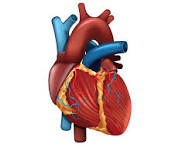

[](https://heart-failure-survival-pro-ewdnqvxcsymzzzuvvjtbjl.streamlit.app/)


# Heart Failure Survival – Pro Edition

[](https://www.python.org/)
[](https://streamlit.io)
[](https://scikit-learn.org/stable/)
[](https://xgboost.readthedocs.io/)
[](LICENSE)

An end-to-end, production-style ML project:

- **From-scratch Logistic Regression** baseline (your theory signal ✅)
- Model **benchmarking** (custom logistic regression, sklearn logistic, Random Forest, XGBoost)
- **Cross-validation metrics** + persisted artifacts
- **Streamlit UI** with dark mode, modern cards, local images, and **SHAP** explainability
- Clean project layout, **Dockerfile**, and one-command run

> **Disclaimer**: This repository is for **educational** purposes only and is **not** for clinical use.

---

## ✨ Demo (Screenshots)

| App Header & Prediction | SHAP Explainability |
|--|--|
|  | |


> You can add real screenshots by pressing `s` in your browser or using macOS `⌘+Shift+4` and saving under `reports/figures/`.

---

## 🧰 Tech Stack

- **Python**, **NumPy**, **Pandas**
- **scikit-learn**, **XGBoost**
- **SHAP** for explainability
- **Streamlit** for the web UI
- **Matplotlib** for plots
- **joblib** for artifact persistence

---


---

## 🚀 Quickstart

```bash
# 1) Clone and enter
git clone https://github.com/<your-username>/heart-failure-survival-pro.git
cd heart-failure-survival-pro

# 2) (Recommended) Create & activate a virtualenv
python3 -m venv .venv
source .venv/bin/activate

# 3) Install requirements
pip install -r requirements.txt

# 4) Train models + export artifacts to models/artifacts/
python train.py

# 5) Launch the app
streamlit run app.py


